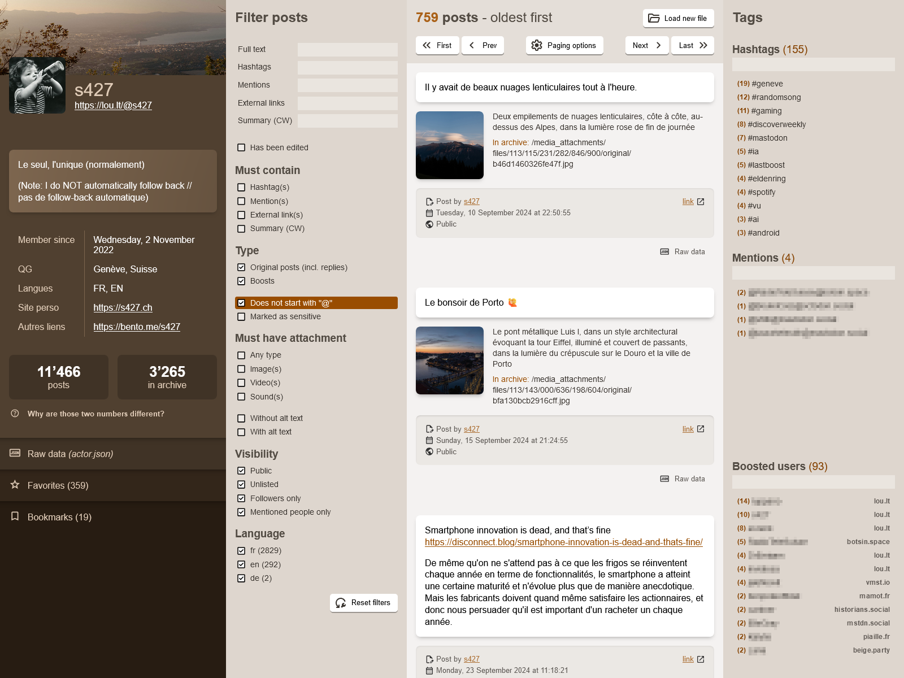

# MARL - Mastodon Archive Reader Lite

## About

MARL is a lightweight, single-page app that provide a user-friendly interface to explore the content of a Mastodon archive file: account data, posts, attachments, etc.

Project page: https://github.com/s427/MARL

## Usage

__Access MARL online here:__ https://s427.github.io/MARL/

Alternatively, you can download this project from its [project page](https://github.com/s427/MARL), unpack it on your device, and simply launch (double click) `index.html`.

## Screenshot

## Features

__What data is shown__

- basic profile info, including pictures (avatar, banner)
- full profile JSON data
- favorites (*)
- bookmarks (*)
- posts, including attachments (images, sounds, videos)
- boosts (*)
- full JSON data for each post or boost
- an overview of all the hashtags or mentions in your posts (will update dynamically depending on the active filters)
- an overview of all the users whose posts you have boosted

(*) see "Limitations" below.

__Direct support for archive files__

No need to unpack your archive. Just drag'n'drop your file in the MARL window, and MARL will unpack it for you. This takes place in your browser's memory: no files are written on your disks. It's also strictly read-only: your archive file is not altered in any way.

__Strictly in-browser only__

Everything takes place in the browser, with no communication with any server (once the page has been loaded). Your archive data is _not_ sent to any server. No analytics are included either.

__Filters__

Many filters allow you to quickly find a subset of posts in your archive:
- search full text, or exclusively in hashtags, mentions, content warnings or external links
- filter posts depending on their language or visibility (public, unlisted etc)
- filter posts depending on whether they contain images, videos or sounds
- and more.

__Media viewer__

Posts attachments (images, videos or sounds) can be viewed or played in MARL. However there may be some limitations depending on the size of the attachment, as well as your browser and/or device.

__Accessibility__

MARL should be fully accessible to keyboard users. It also has been optimized for Forced Colors (aka "High Contrast" mode). Last but not least, it should be accessible to screen readers.  
Accessibility is a vast and complex topic, and there's probably room for improvement. Feel free to let me know if you have feedback or suggestion!

__Responsive__

MARL should work on pretty much any screen size, as low as 300 pixels wide (and possibly less).

## Limitations

Everything is based on the data contained in the Mastodon archive file. As far as I can tell, the archive does __not__ include:

- a list of the accounts you follow or are followed by
- a list of your blocked or muted accounts
- your lists
- your pinned posts

Some data may not be shown in MARL, by choice or oversight. This is why the full JSON data for the account is also displayed, as well as the full JSON data for each of your post (below each post).

### Heavy attachments

MARL will try to load images, sounds or videos that are attached to your posts. However, this all takes place in your browser/OS memory. Very large images or videos may fail to load. You can still find them by unpacking your archive: for each attachment, MARL tells you the exact path where you can find it in your archive.

### Boosts, favorites and bookmarks

As far as I can tell, any content that is not directly hosted on your instance (in other words, any content that originated from another instance, but that you may have boosted, liked or bookmarked) is stored _for a limited time_ in your instance cache. How long that time is depends on your instance configuration. Once a post expires (is removed) from this cache, it is also removed from your account (as a boost, favorite or bookmark) and therefore _will not be included in your archive_.

__This affects boosts, favorites and bookmarks__ —except for posts that are hosted on your instance directly (i.e. your own posts, or posts from other members of your instance). This explains why the actual number of posts shown by MARL may be significantly lower than the "official" number of posts displayed on your Mastodon profile. Conversations with users hosted on other instances may also be broken for the same reason.

Moreover, even when those external posts have _not_ expired, the data that is included in the archive is _very_ sparse: basically a single URL to the post on its original instance. It is not possible to programmatically fetch more data from those URLs, as Mastodon servers currently do not allow cross-origin resource sharing (CORS). (See [this issue](https://github.com/mastodon/mastodon/issues/10400) on the official Mastodon project page.)

As a result, MARL can only show you very little data for your boosts, bookmarks and favorites.

## Disclaimer

This is a personal, non-official project. I am not associated with the Mastodon project in any way. A lot of the way MARL works is based on guesswork on my part when trying to understand the archive structure. Feel free to let me know if you think I've missed or misunderstood something!

You can reach me via github or on Mastodon:  
Github: https://github.com/s427  
Mastodon: https://lou.lt/@s427
