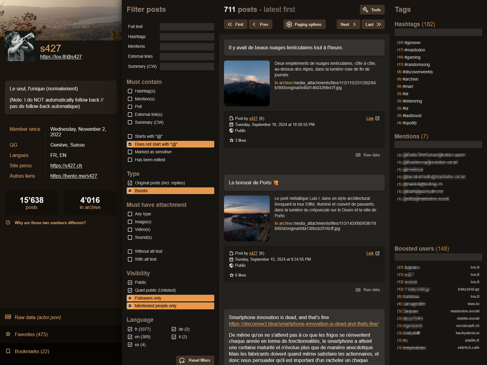
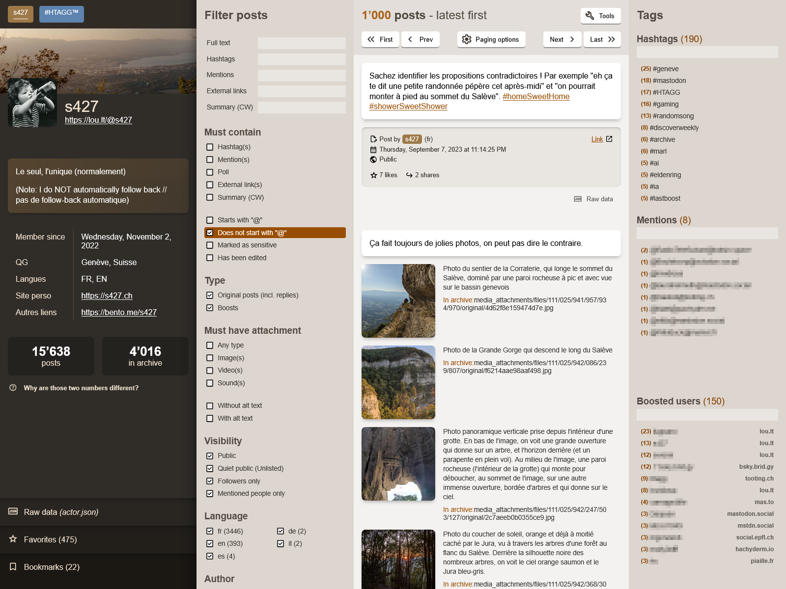
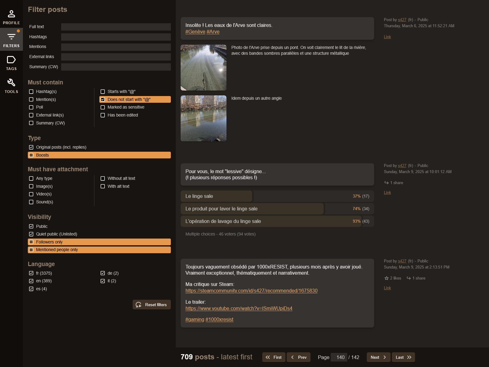

# MARL - Mastodon Archive Reader Lite

## About

MARL is a lightweight, single-page app that provides a user-friendly interface to explore the content of a Mastodon archive file: account data, posts, attachments, etc.

## Project links

- __Project page__: https://github.com/s427/MARL
- __Demo page__: https://marl.s427.ch  
  Uses a subset of my own archive data.
- __Try it for yourself__: https://s427.github.io/MARL/  
  Online version - you need to have your own archive.
- __Announcement post__ (should you want to spread the word 😊):  
  English: https://lou.lt/@s427/113567190207673533  
  French: https://lou.lt/@s427/113567186376766727

## Usage

__You can use the online version here:__ https://s427.github.io/MARL/

__Alternatively__, you can download this project from its [project page](https://github.com/s427/MARL), unpack it on your device, and simply launch (double click) `index.html`. That's it. No installation is necessary.

⚠️ __Only ZIP files are supported__ —not GZ files. This is a limitation of the JSZip library which is used by MARL to unpack the archive file. Older versions of Mastodon (prior to version 4.2.0) used to export the archive in TAR.GZ. If this is your case, you will have to first convert your archive to a ZIP file.

⚠️ __A note about very large archives:__ Browsers may struggle opening very large ZIP files (several GB), in which case you will see an error and the archive will not be loaded. If this happens, you can try upacking your archive, removing the `media_attachments` folder, and repacking everything else. This will significantly reduce the size of the archive, by removing all attachments from your posts (images, videos or sounds). MARL will still be able to work without those attachments and display their media type and alt text (or lack thereof). Filters related to attachments still work too. Also note that for each attachment, MARL indicates where you can find it in your archive.  
Another solution to this problem is to use MARL in __server mode__. See below for more information.

## Screenshots

Default layout, dark theme, one archive loaded:  

Default layout, light theme, two archives loaded:  

Simplified layout, dark theme, one archive loaded:  

## Features

### What data is shown

- basic profile info, including pictures (avatar, banner)
- full profile JSON data
- favorites (*)
- bookmarks (*)
- posts, including attachments (images, sounds, videos) and polls
- boosts (*)
- full JSON data for each post or boost
- an overview of all the hashtags or mentions in your posts (will update dynamically depending on the active filters)
- an overview of all the users whose posts you have boosted

(*) see "Limitations" below.

### No installation or dependencies

No need to install anything. Just open `index.html` and you're good to go!

### Direct support for archive files

No need to unpack your archive. Just drag'n'drop your file in the MARL window, and MARL will unpack it for you. This takes place in your browser's memory: no files are written on your disks. It's also strictly read-only: your archive file is not altered in any way.

### Strictly in-browser only

Everything takes place in the browser, with no communication with any server (once the page has been loaded). Your archive data is _not_ sent to any server. No analytics are included either.

### Support for multiple archives

You can open multiple archive files at once (or add some more after via drag'n'drop) and MARL will show you all their posts in a single chronological list, as well as all the profiles in a tabbed interface. Each profile is automatically color-coded. A new group of filters allows you to filter posts by author.

### Filters

Many filters allow you to quickly find a subset of posts in your archive:
- search full text, or exclusively in hashtags, mentions, content warnings or external links
- filter posts depending on their language or visibility (public, unlisted etc)
- filter posts depending on whether they contain images, videos or sounds
- filter posts based on their number of likes or shares
- filter posts based on their date/time of publication
- and more.

### Media viewer

Posts attachments (images, videos or sounds) can be viewed or played in MARL. However there may be some limitations depending on the size of the attachment, as well as your browser and/or device.

### Accessibility

MARL should be fully accessible to keyboard users. It also has been optimized for Forced Colors (aka "High Contrast" or "Contrast Theme") mode. Last but not least, it should be accessible to screen readers.  
Accessibility is a vast and complex topic, and there's probably room for improvement. Feel free to let me know if you have feedback or suggestion!

### Multilingual

MARL is available in English, French and Spanish. Get in touch if you want to help translating it in your language! (The file for English can be found at `dev/public/js/i18n/en.js`.)

### Responsive

MARL should work on pretty much any screen size, as low as 300 pixels wide (and possibly less).

### Persistent settings

All options in the "Tools" panel are stored in the browser and automatically restored when the app is initialized, so that you don't have to re-set them the way you like it every time.

### Server mode

You can use MARL to automatically fetch and load an archive from the server of your choice. This basically allows you to use MARL as an archive publishing tool. You will need to host MARL on a web server. Read [server-mode.md](server-mode.md) for more information.

## Limitations

Everything is based on the data contained in the Mastodon archive file. As far as I can tell, the archive does __not__ include:

- a list of the accounts you follow or are followed by
- a list of your blocked or muted accounts
- your lists
- your pinned posts
- posts edit history

Some data may not be shown in MARL, by choice or oversight. This is why the full JSON data for the account is also displayed, as well as the full JSON data for each of your post (below each post).

### Heavy attachments

MARL will try to load images, sounds or videos that are attached to your posts. However, this all takes place in your browser/OS memory. Very large images or videos may fail to load. You can still find them by unpacking your archive: for each attachment, MARL tells you the exact path where you can find it in your archive.

### Boosts, favorites and bookmarks

As far as I can tell, any content that is not directly hosted on your instance (in other words, any content that originated from another instance, but that you may have boosted, liked or bookmarked) is stored _for a limited time_ in your instance cache. How long that time is depends on your instance configuration. Once a post expires (is removed) from this cache, it is also removed from your account (as a boost, favorite or bookmark) and therefore _will not be included in your archive_.

__This affects boosts, favorites and bookmarks__ —except for posts that are hosted on your instance directly (i.e. your own posts, or posts from other members of your instance). This explains why the actual number of posts shown by MARL may be significantly lower than the "official" number of posts displayed on your Mastodon profile. Conversations with users hosted on other instances may also be broken for the same reason.

Moreover, even when those external posts have _not_ expired, the data that is included in the archive is _very_ sparse: basically a single URL to the post on its original instance. It is not possible to programmatically fetch more data from those URLs, as Mastodon servers currently do not allow cross-origin resource sharing (CORS). (See [this issue](https://github.com/mastodon/mastodon/issues/10400) on the official Mastodon project page.)

As a result, MARL can only show you very little data for your boosts, bookmarks and favorites.

## Tech

Third-party libraries and assets used:
- [JSZip](https://stuk.github.io/jszip/) v3.10.1
- [AlpineJs](https://alpinejs.dev/) v3.14.5
- [alpinejs-i18n](https://github.com/rehhouari/alpinejs-i18n) v2.5.2
- [Material Icons](https://fonts.google.com/icons)

All are stored within the project; no request to a CDN or third-party server is made by MARL.  
Everything else coded by me.

## Disclaimer

This is a personal, non-official project. I am not associated with the Mastodon project in any way. A lot of the way MARL works is based on guesswork on my part when trying to understand the archive structure. Feel free to let me know if you think I've missed or misunderstood something!

You can reach me via github or on Mastodon:  
Github: https://github.com/s427  
Mastodon: https://lou.lt/@s427

## Credits

Spanish translation: https://github.com/anauta

## Version history

- v. 2.10
  - [Github issue #14](https://github.com/s427/MARL/issues/14) - Spanish translation. Thanks to [@anauta](https://github.com/anauta)!
- v. 2.9
  - [NEW] Conversation view
    - When two posts (or more) are direct replies to each other, a new "Show thread" button allows to view all the posts in the thread.
    - A new "Is part of a thread" filter has been added to show those posts only.
    - Limitation (as explained in the app): MARL can only show posts that are present in the archive. Posts written by other people are typically not included in an archive. If posts are missing in a thread, it's impossible for MARL to reconnect the broken parts. In other words, this feature will mostly be useful to display posts where you reply to yourself (aka "threads").
  - Server mode:
    - Two new options in `config.js` allow you to choose whether you want the JSON code for posts and/or for your profile to be displayed (default is `false` for both).
  - Various fixes and improvements.
- v. 2.8
  - New filters:
    - Activities: filter posts by the number of likes or shares they received.
    - Date and time: filter posts before/after a certain date; or before/after a given time of the day.
    - The "reset" button is now hidden when not needed; when visible, it remains sticky at the bottom of the filters panel (so that it's always visible).
  - Server mode:
    - You can change the default options for the app in the `config.js` file. All the options found in the tools panel can be set (e.g. number of posts per page, combine panels, etc...). See `config.default.js` for more information.
    - New option in the MARL cleanup script: `-b` allows you to remove all boosts from the archive.
- v. 2.7
  - Posts:
    - The number of likes and shares on posts is now displayed, if available in the archive.  
      (As far as I can tell, this information wasn't present in previous versions of exported data.)
    - Added: language indication for each post
  - Filters:
    - Leaner filters: filters which do not match any post in the archive are automatically hidden. For instance if your archive doesn't contain any video, the "Attachments > Video(s)" filter will be hidden. If the archive contains only public posts (no other types of visibility), the whole "Visibility" filter group is hidden. Etc.
  - Layout:
    - When using the "combine panels" option, the sidebar now remains always visible
    - The paging options (order of posts, number of posts per page) have been moved to the "tools" panel
  - Tools panel:
    - New option: "Default panel". Choose which panel is shown by default when loading the app if the "combine panels" option is active; an option to simply remember the last active panel is available
  - Server mode:
    - JSON data for posts and profile are now hidden
    - If no likes or bookmarks are found, the corresponding panels are hidden
  - Misc minor fixes, layout tweaks and adjustments
- v. 2.6
  - [NEW] support for polls
    - Polls are now correctly displayed and a new filter allows to show only posts that contain a poll
- v. 2.5
  - [NEW] layout options
    - Two new options found in the "Tools" panel allow to simplify the display of posts and declutter the UI by hiding the panels in a toolbar. Those changes will be most visible on larger displays.
  - Misc minor tweaks or fixes
- v. 2.4
  - [NEW] Server mode
    - You can now configure MARL to use it as publishing tool for your archive(s).
    - Please read [server-mode.md](server-mode.md) for more information.
    - A stand-alone script is available in `tools/outbox-cleanup` to generate a JSON file without private posts (it has its own [readme](tools/outbox-cleanup/readme.md)  file).
- v. 2.3
  - [Github issue #10](https://github.com/s427/MARL/issues/10) - Support for archives with `media_attachments` folder removed. This allows very large archive files, which would normally fail to load because they exceed the browser cache capacity, to still be loaded, although without any attachment visible. Attachments metadata (alt text and path) are still shown, and attachment-related filters still work.
- v. 2.2
  - Better error handling when loading files
    - In case of errors, MARL should not remain stuck on the loading screen anymore, but will get back to the welcome screen (or the main screen if another archive is already loaded) and show an error message (either directly on the welcome screen, or in the tools panel).
    - [Github issue #8](https://github.com/s427/MARL/issues/8) - If the JSON files are stored in a subfolder within the ZIP file (instead of being at its root), MARL will attempt to find them and use their location as root.
  - Various small fixes
- v. 2.1
  - [NEW] Internationalization
    - MARL is now usable in English and French, with support for more languages.
    - Get in touch if you want to help translating MARL in your language!
    - The language files can be found in `dev/public/js/i18n`.
  - [NEW] Tools panel
    - A new "Tools" button will open a new panel, where you can change various settings for the app (language, theme) as well as see information about your loaded files, messages from the app (app log), and the "about" section.
    - Those settings are saved locally in the browser (localStorage) and automatically applied every time the app is launched.
- v. 2.0
  - Code refactoring: MARL now uses Astro to build its HTML code as well as optimize and bundle its assets (CSS, SVG, images).
  - All assets used to build MARL are now stored in the `dev` folder.
  - The compiled, ready-to-use app can be found in the `dist` folder.
  - Except for the fact that it's now minified and packaged differently, everything works exactly the same as in version 1.3 for the end user (no new features).
- v. 1.3
  - [NEW] dark theme
    - Will be set automatically based on your OS or browser preference (default to light if no preference is detected)
    - Support to manually choose the app theme will come in a later update
  - Misc minor tweaks or fixes
- v. 1.2
  - [NEW] support for multiple archive files. Notes:
    - You can select multiple files from the open dialog;
    - If one or several files are already loaded, you can drag and drop more files anywhere on the app window in order for MARL to load those new files and add them to the ones already loaded;
    - For now the "Load new file" button still assumes you want to start over (blank slate); this will probably be changed in a future version.
- v. 1.1
  - [NEW] Paging preferences (page size and posts order) are automatically saved to the browser and restored on app load if present
  - Various bug fixes and improvements
- v. 1.0
  - Initial release
